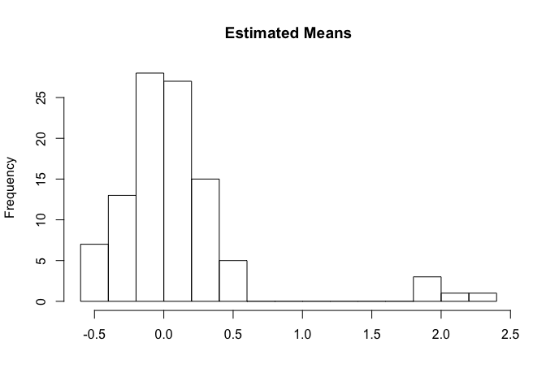
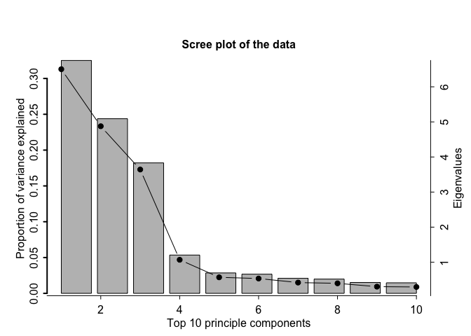
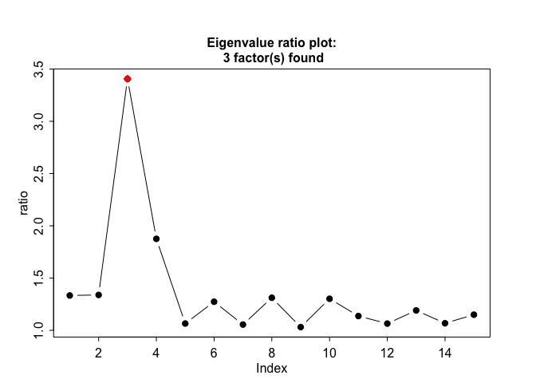

<!-- README.md is generated from README.Rmd. Please edit that file -->
FarmTest: Factor Adjusted Robust Multiple Testing
=================================================

Goal of the package
-------------------

This R package conducts multiple hypothesis testing of mean effects. It implements a robust procedure to estimate distribution parameters and accounts for strong dependence among coordinates via an approximate factor model. This method is particularly suitable for high-dimensional data when there are thousands of variables but only a small number of observations available. Moreover, the method is tailored to cases when the underlying distribution deviates from Gaussianity, which is commonly assumed in the literature. See the paper on this method, Zhou et al.(2017)<https://goo.gl/68SJpd>, for detailed description of methods and further references.

The observed data *X* is assumed to follow a factor model , where *f* are the underlying factors, *B* are the factors loadings, *u* are the errors, and *μ* is the mean effect to be tested. We assume the data is of dimension *p* and the sample size is *n*, leading to *p* hypothesis tests.

Installation
------------

You can install FarmTest from github with:

``` r
install.packages("devtools")
devtools::install_github("kbose28/FarmTest")
library(FarmTest)
```

Getting help
------------

Help on the functions can be accessed by typing "?", followed by function name at the R command prompt.

Issues
------

-   Error: "...could not find build tools necessary to build FarmTest": Since `FarmTest` relies on `C++` code, command line tools need to be installed to compile the code. For Windows you need Rtools, for Mac OS X you need to install Command Line Tools for XCode. See (<https://support.rstudio.com/hc/en-us/articles/200486498-Package-Development-Prerequisites>).

-   Error: "library not found for -lgfortran/-lquadmath": It means your gfortran binaries are out of date. This is a common environment specific issue.

    1.  In R 3.0.0 - R 3.3.0: Upgrading to R 3.4 is strongly recommended. Then go to the next step. Alternatively, you can try the instructions here: <http://thecoatlessprofessor.com/programming/rcpp-rcpparmadillo-and-os-x-mavericks-lgfortran-and-lquadmath-error/>.

    2.  For &gt;= R 3.4.\* : download the installer from the here: <https://gcc.gnu.org/wiki/GFortranBinaries#MacOS>. Now simply run the installer. (If installer is not available for your version of OS, use the latest one.)

-   Error: "... .rdb': No such file or directory" Try devtools::install\_github("kbose28/FarmTest", dependencies=TRUE)

-   Error in RStudio even after installing XCode: "Could not find tools necessary to build FarmTest": This is a known bug in RStudio. Try options(buildtools.check=function(action) TRUE) in RStudio to prevent RStudio from validating build tools.

Functions
---------

There are three functions available.

-   `farm.test`: The main function farm.test which carries out the entire hypothesis testing procedure.
-   `farm.FDR`: Apply FDR control to a list of input p-values. This function rejects hypotheses based on a modified Benjamini- Hochberg procedure, where the proportion of true nulls is estimated using the method in (Storey 2015).
-   `farm.scree`: Estimate the number of factors if it is unknown. The farm.scree function also generates two plots to illustrate how the number of latent factors is calculated.

Simple hypothesis testing example
---------------------------------

Here we generate data from a factor model with 3 factors. We have 20 samples of 100 dimensional data. The first five means are set to 2, while the other ones are 0. We conduct a hypotheses test for these means.

``` r
library(FarmTest)
set.seed(100)
p = 100
n = 20
epsilon = matrix(rnorm( p*n, 0,1), nrow = n)
B = matrix(rnorm(p*3,0,1), nrow=p)
fx = matrix(rnorm(3*n, 0,1), nrow = n)
mu = rep(0, p)
mu[1:5] = 2
X = rep(1,n)%*%t(mu)+fx%*%t(B)+ epsilon
output = farm.test(X)
#> Call:
#> farm.test(X = X)
#> 
#>  One Sample Robust Test with Unknown Factors
#> 
#> p = 100, n = 20, nfactors = 3
#> FDR to be controlled at: 0.05
#> alternative hypothesis: two.sided
#> hypotheses rejected:
#>  6
```

Now we carry out a one-sided test, with the FDR to be controlled at 1%. Then we examine the output

``` r
output = farm.test(X, alpha = 0.01,alternative = "greater")
#> Call:
#> farm.test(X = X, alternative = "greater", alpha = 0.01)
#> 
#>  One Sample Robust Test with Unknown Factors
#> 
#> p = 100, n = 20, nfactors = 3
#> FDR to be controlled at: 0.01
#> alternative hypothesis: greater
#> hypotheses rejected:
#>  5
names(output)
#> [1] "means"    "stderr"   "loadings" "nfactors" "pvalue"   "rejected"
#> [7] "alldata"
print(output$rejected)
#>      index       pvalue pvalue adjusted
#> [1,]     4 4.252076e-22    4.252076e-20
#> [2,]     2 5.822415e-09    2.911208e-07
#> [3,]     3 6.759935e-08    2.253312e-06
#> [4,]     1 2.681754e-06    6.704385e-05
#> [5,]     5 3.159253e-05    6.318506e-04
hist(output$means, 10, main = "Estimated Means", xlab = "")
```



Other functions
---------------

The function `farm.scree` makes some informative plots. It is possible to specify the maximum number of factors to be considered and the maximum number of eigenvalues to be calculated in this function. We recommend min(n,p)/2 as a conservative threshold for the number of factors; this also prevents numerical inconsistencies like extremely small eigenvalues which can blow up the eigenvalue ratio test.

``` r
output = farm.scree(X, K.factors = 15, K.scree = 10)
#> Warning in farm.scree(X, K.factors = 15, K.scree = 10): Number of factors
#> supplied is > min(n,p)/2. May cause numerical inconsistencies
```



We see a warning telling us that it is not a good idea to calculate 15 eigenvalues from a dataset that has only 20 samples.

Let us generate data from a Gaussian distribution with mean 0. Suppose we perform a simple `t.test` in R and need to adjust the output p-values for multiple testing. The function `farm.FDR` lets us carry out multiple comparison adjustment and outputs rejected hypotheses. We see that there are no rejections, as expected from a zero-mean Gaussian distribution.

``` r
set.seed(100)
Y = matrix(rnorm(1000, 0, 1),10)
pval = apply(Y, 1, function(x) t.test(x)$p.value)
output = farm.FDR(pval)
output$rejected
#> [1] "no hypotheses rejected"
```

Notes
-----

1.  If some of the underlying factors are known but it is suspected that there are more confounding factors that are unobserved: Suppose we have data , where *f* is observed and *g* is unobserved. In the first step, the user passes the data {*X*, *f*} into the main function. From the output, let us construct the residuals: . Now pass  into the main function, without any factors. The output in this step is the final answer to the testing problem.

2.  Number of rows and columns of the data matrix must be at least 4 in order to be able to calculate latent factors.

3.  The farm.FDR function uses code from the [`pi0est`](https://www.rdocumentation.org/packages/qvalue/versions/2.4.2/topics/pi0est) function in the [`qvalue`](http://bioconductor.org/packages/release/bioc/html/qvalue.html) package (Storey 2015) to estimate the number of true null hypotheses, and inherits all the options from `pi0est`.

4.  See individual function documentation for detailed description of methods and their references.

Storey, JD. 2015. “Qvalue: Q-Value Estimation for False Discovery Rate Control.” *R Package Version 2.8.0*. <https://github.com/jdstorey/qvalue>.
